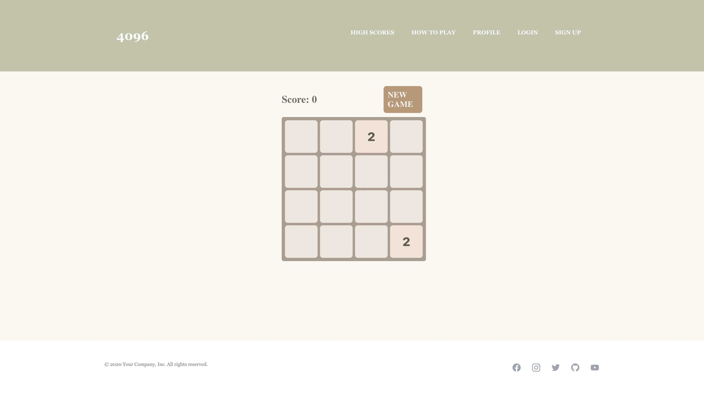
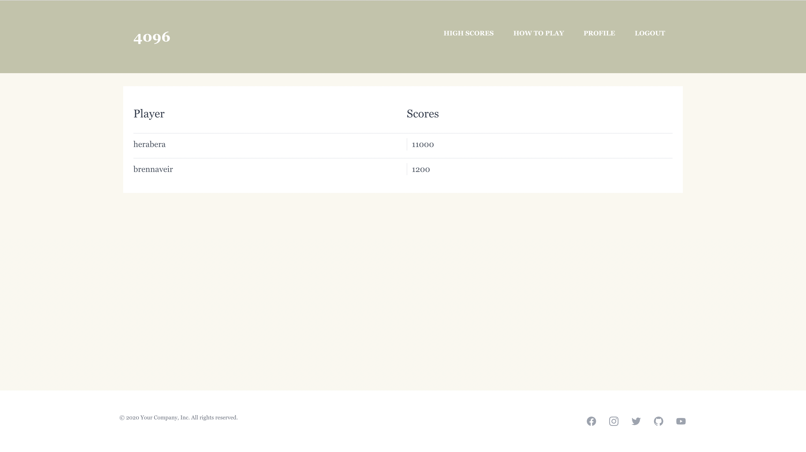
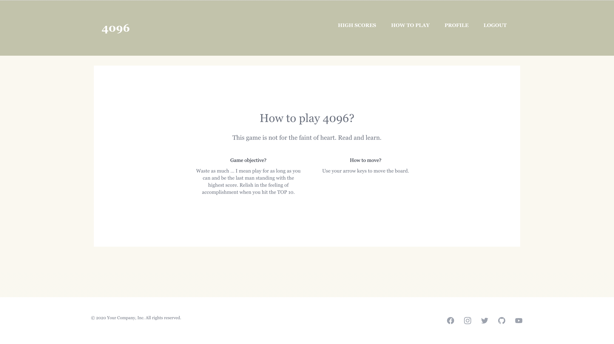
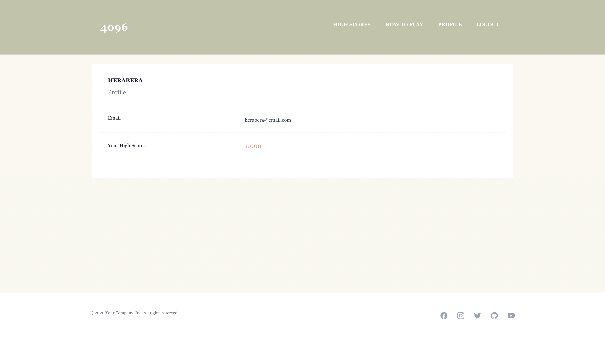
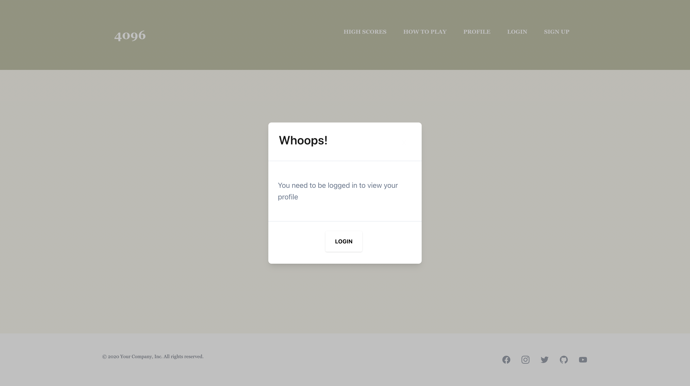
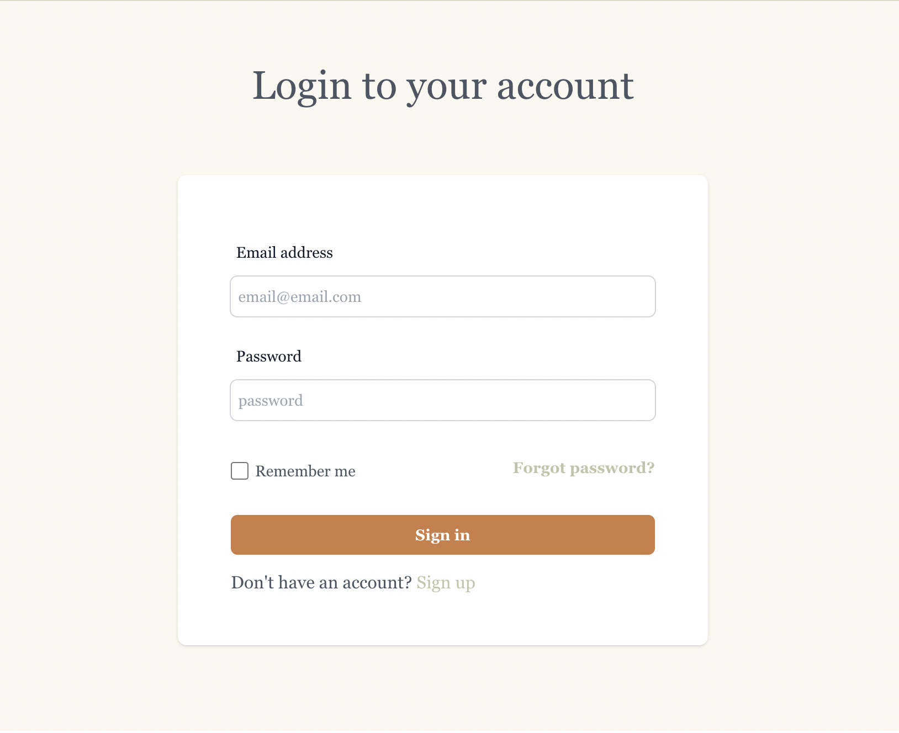

# 4096

## Table of Contents 

- [Description](#description)
- [Usage](#usage)
- [Contributors](#contributors)
- [License](#license)
- [Questions](#questions)

## Description
Whether you're trying to take a break, are bored or just want to brush up on your elementary math skills, 4096 is the game for you. A simple game, made to help you step away from life and de-stress. Simply using your arrow keys to merge like number tiles together until you reach the number 4096 to win. Filled the board up before you made it?? No worries! Click the TRY AGAIN button and keep keying away. 

## Usage

+ Deployed Application (Heroku): [4096!](https://highfives-4096.herokuapp.com/)
+ GitHub Repository: https://github.com/JeevanMKJ/4096

## Contributors
+ Brenn Voyles
+ Jeevan Morgan Kreb-Jones
+ Tyler Wait
+ Priyanka Agrawal
